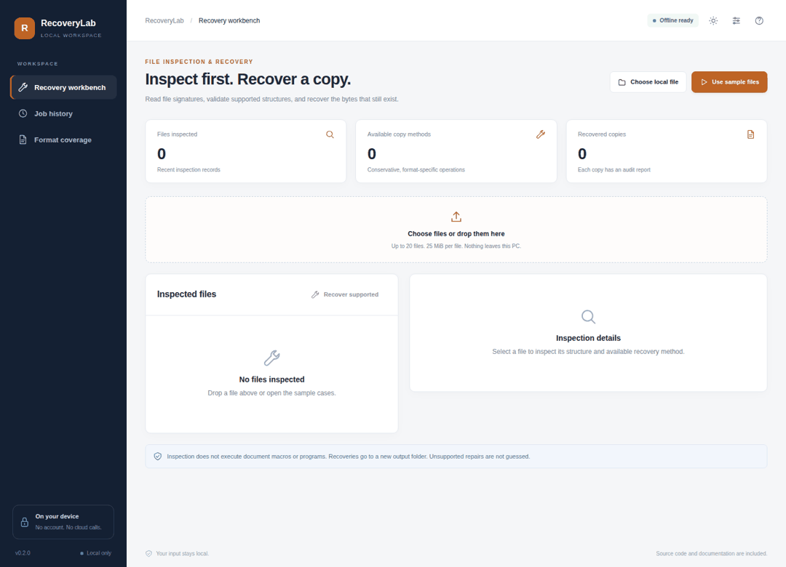
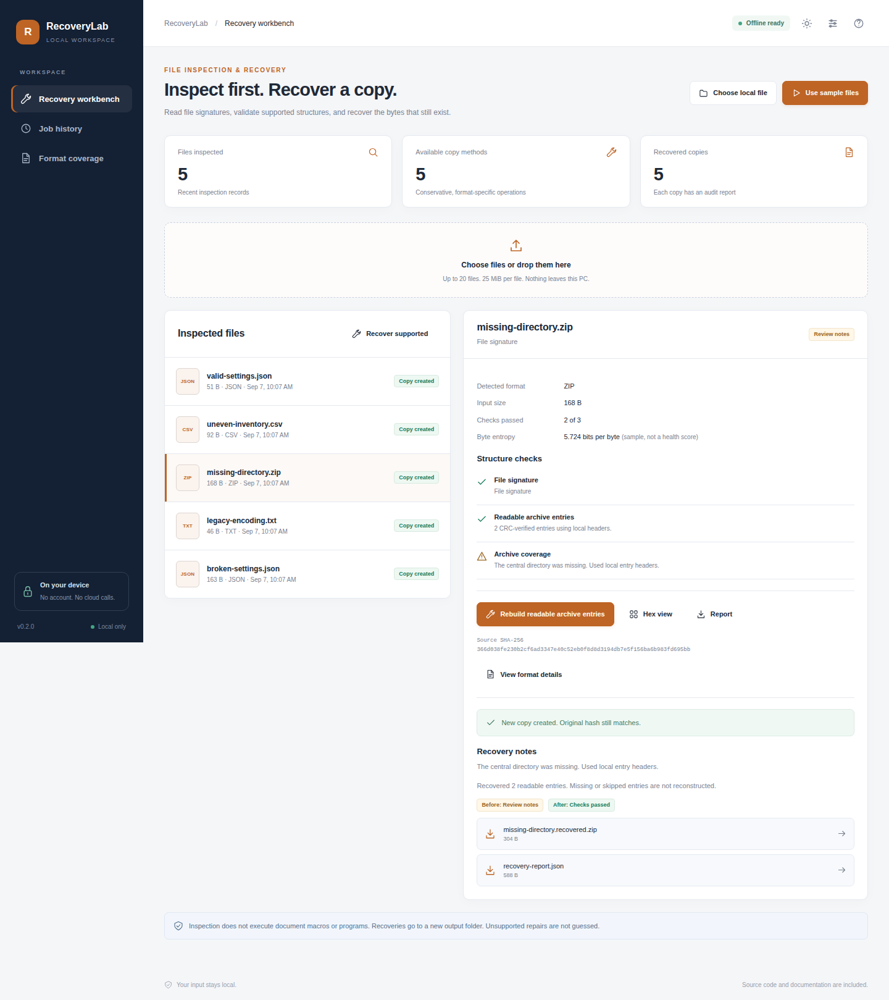
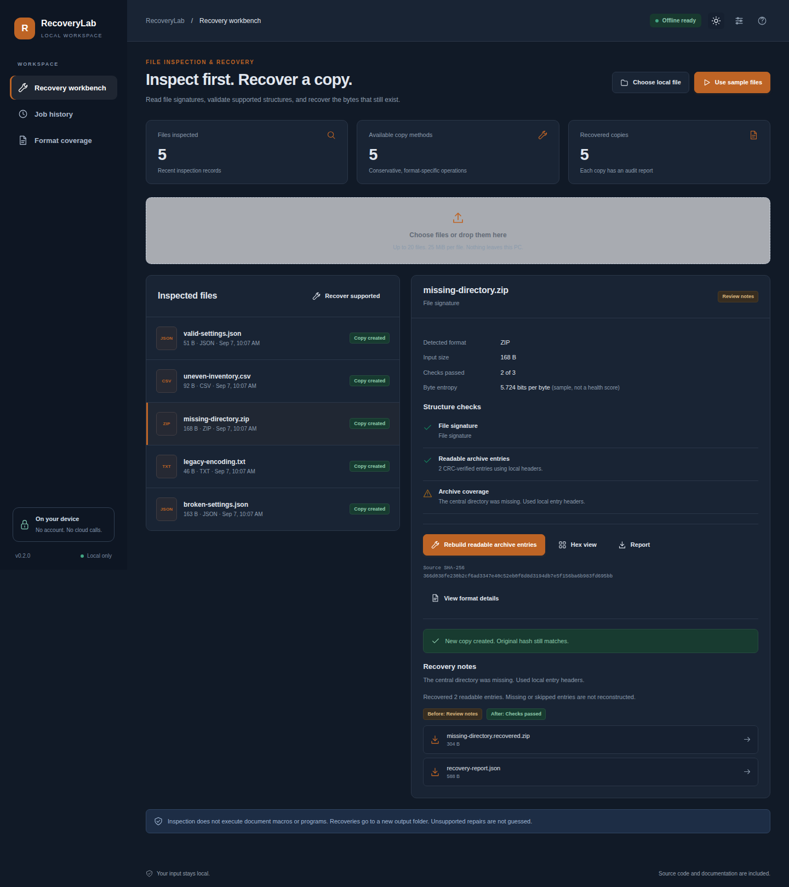

# RecoveryLab

Inspect damaged files and create a recovered copy when a safe method is available.

[](https://github.com/danial-maqbool/RecoveryLab/actions/workflows/tests.yml)




RecoveryLab is a local recovery workbench. It inspects a file first, explains what looks wrong, and only offers recovery methods that the app can check. The original file is never edited in place.

## Main features

- File signature, checksum, structure, and hex inspection
- JSON, JSONL, CSV, text, and encoding recovery
- ZIP recovery for readable entries
- PDF and Office package reconstruction
- Image decode and re-encode recovery
- SQLite readable-row recovery
- Local FFmpeg video remuxing
- Batch recovery with reports and source hashes

## Quick start

```bash
git clone https://github.com/danial-maqbool/RecoveryLab.git
cd RecoveryLab
```

**Windows**

```powershell
py -3 bootstrap.py
.\start.bat --demo
```

**Linux / macOS**

```bash
python3 bootstrap.py
sh start.sh --demo
```

Video recovery needs `ffmpeg` and `ffprobe` installed locally.

## Screenshots

<p align="center">
  
  
</p>

## Project layout

```text
app/        inspection and recovery logic
web/        local interface
localdesk/  local runtime, vault and jobs
examples/   sample damaged files
tests/      automated tests
scripts/    verification tools
docs/       setup, design and test notes
```

## Notes

RecoveryLab can only work with data that is still readable. It does not invent missing bytes and it is not a malware-cleaning tool. Important recovered files should be opened in their normal application and checked.

More details: [Setup](docs/SETUP.md) · [User guide](docs/USER_GUIDE.md) · [Architecture](docs/ARCHITECTURE.md) · [Testing](docs/VERIFICATION.md) · [Security](SECURITY.md)

## License

MIT. See [LICENSE](LICENSE).
